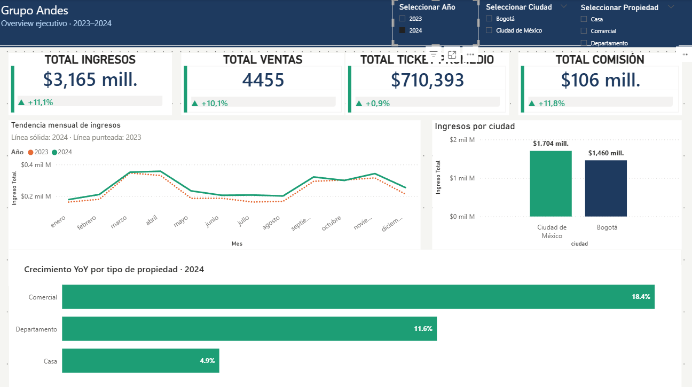
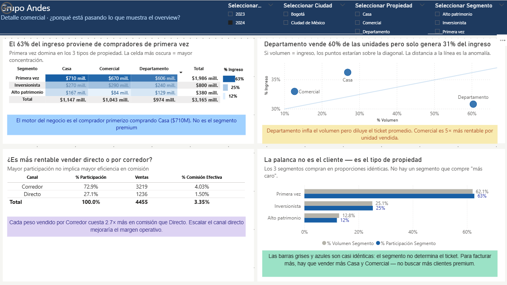
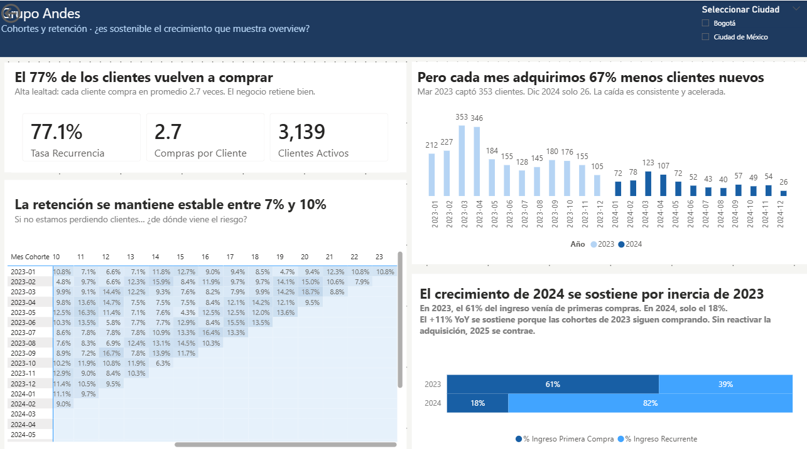

# Análisis Comercial Inmobiliario — Grupo Andes

**¿El +11% de crecimiento YoY es real? ¿Qué tipo de propiedad realmente mueve el negocio? ¿Los clientes vuelven — y si vuelven, por qué el ingreso depende cada vez más de ellos?**

Estas fueron las preguntas que surgieron al analizar 8,500 transacciones inmobiliarias de Grupo Andes, una empresa con operaciones en Bogotá y Ciudad de México. Lo que encontré cambió la lectura completa del negocio: el crecimiento que celebra el overview es insostenible.

---

## 📌 Por qué elegí este proyecto

Quería construir un dashboard en Power BI que no fuera solo un ejercicio de visualización, sino un caso de análisis de negocio completo — desde la auditoría de datos hasta una recomendación que un director comercial pudiera ejecutar al día siguiente.

El dataset de Grupo Andes me pareció ideal: un modelo transaccional limpio con dimensiones de cliente, propiedad y canal que permite cruzar volumen con rentabilidad, analizar cohortes de adquisición y detectar patrones que los KPIs tradicionales no revelan. Tres preguntas guiaron el análisis:

1. **¿Vamos bien o mal?** — KPIs de desempeño general con comparación YoY dinámica
2. **¿Por qué está pasando lo que vemos?** — Mix de producto, canal y segmento con sus paradojas
3. **¿Es sostenible?** — Análisis de cohortes que revela si el crecimiento tiene fundamento

---

## 🎯 Objetivo

Construir un dashboard de 3 vistas narrativas que permita al equipo directivo no solo ver qué pasa, sino entender por qué pasa y decidir qué hacer al respecto.

---

## 📊 Vista previa del dashboard

| Overview ejecutivo | Detalle comercial | Cohortes y retención |
|---|---|---|
|  |  |  |

---

## 📁 Datasets utilizados

| Archivo | Filas | Columnas | Descripción |
|---|---|---|---|
| `hecho_ventas_propiedades.csv` | 8,500 | 10 | Transacciones de venta: precio, cliente, propiedad, canal, comisión |
| `dim_clientes.csv` | 3,500 | 4 | Segmentación de compradores: Primera vez, Alto patrimonio, Inversionista |
| `dim_propiedades.csv` | 8,000 | 8 | Características del activo: tipo, ciudad, barrio, tamaño, precio de lista |
| `dim_fecha` (DAX) | 731 | 9 | Tabla calendario generada con `CALENDAR` + `ADDCOLUMNS` |

**Periodo cubierto:** Enero 2023 – Diciembre 2024 (24 meses completos).

---

## 🔍 Lo que encontré — y lo que significa

### 💰 Vista 1 — Overview ejecutivo

**El negocio creció +11.1% YoY — y eso es lo que cualquier director quiere escuchar.**
Al comparar 2023 ($2,848M) contra 2024 ($3,165M), todos los indicadores apuntan hacia arriba: +10.1% en volumen de ventas, +0.9% en ticket promedio, +11.8% en comisión total. Ciudad de México concentra el 54% del ingreso frente al 46% de Bogotá. En superficie, el negocio está sano.

**La estacionalidad es predecible: picos en marzo-abril y septiembre-noviembre.**
La tendencia mensual muestra un patrón que se repite idéntico en ambos años — dos picos con un valle en julio-agosto. Esta información debería traducirse en planificación de inventario y dotación de equipo comercial.

**Comercial lideró el crecimiento YoY (+18.4%), seguido de Departamento (+11.6%) y Casa (+4.9%).**
Pero estos porcentajes esconden una paradoja que solo se revela al cruzar volumen con ingreso — lo que llevó directamente a la Vista 2.

---

### 🏗️ Vista 2 — Detalle comercial

**Departamento vende 60% de las unidades pero solo genera 31% del ingreso.**
Este fue el hallazgo que reorientó todo el análisis. Al graficar % de volumen contra % de ingreso en un scatter plot, la anomalía saltó a la vista: Departamento está muy lejos de la diagonal de equilibrio. Su ticket promedio ($362K) es 5 veces menor que el de Comercial ($1.8M). Vender más unidades de Departamento infla el volumen pero diluye la facturación.

**El motor del negocio es el comprador primerizo comprando Casa ($710M).**
Al cruzar segmento × tipo en una matriz con escala de calor, la celda más oscura fue Primera vez × Casa. No Alto patrimonio. No Inversionista. El 63% del ingreso total proviene de compradores de primera vez, y los tres segmentos tienen tickets promedio prácticamente idénticos — ninguno compra "más caro" que otro.

**Cada peso vendido por Corredor cuesta 2.7× más en comisión que por canal Directo.**
Corredor genera el 73% del ingreso con una comisión efectiva del 4.02%. Directo solo el 27%, pero a 1.50%. La implicación es clara: escalar el canal Directo no es un proyecto de innovación — es una decisión de margen operativo.

---

### 📉 Vista 3 — Cohortes y retención

**El 77% de los clientes vuelven a comprar. La retención se mantiene estable entre 7-10%.**
Estos números tranquilizan. Un negocio con 2.7 compras promedio por cliente y retención plana mes a mes no tiene un problema de fidelización. Si solo vieras estas métricas, dormirías tranquilo.

**Pero cada mes llegan 67% menos clientes nuevos — y ahí está el riesgo real.**
En 2023, Grupo Andes captaba en promedio 197 clientes nuevos por mes. En 2024, solo 64. Marzo de 2023 captó 353 clientes; diciembre de 2024 apenas 26. La caída es consistente, no estacional, y no hubo un solo mes de 2024 que superara al peor mes de 2023.

**El +11% YoY se sostiene por inercia — no por impulso.**
Este fue el hallazgo que cerró todo el dashboard. En 2023, el 61% del ingreso provenía de primeras compras. En 2024, solo el 18%. El negocio pasó de ser impulsado por adquisición a sostenerse exclusivamente por la recompra de clientes existentes. Las cohortes grandes de 2023 siguen comprando, pero las de 2024 son 67% más pequeñas. Cuando esa inercia se agote, no habrá base suficiente para sostener el ingreso.

---

## 📐 Modelo de datos

Esquema estrella con la tabla de hechos `fct_ventas` al centro y tres dimensiones conectadas por relaciones uno-a-muchos con dirección de filtro simple:

```
dim_clientes ──(id_cliente)──► fct_ventas ◄──(id_propiedad)── dim_propiedades
                                   ▲
                              (fecha_venta)
                               dim_fecha
```

Los campos redundantes (`ciudad`, `tipo_propiedad`, `fecha_venta`) fueron ocultados en la tabla de hechos para forzar el filtrado exclusivo desde las dimensiones.

---

## ⚙️ Medidas DAX

23 medidas organizadas en 8 carpetas funcionales dentro de la tabla `_Medidas`, más 4 columnas calculadas en `fct_ventas`:

| Carpeta | Contenido |
|---------|-----------|
| `01_Base` | Ingreso Total, Cantidad de Ventas, Ticket Promedio, Comisión Total, % Comisión Efectiva |
| `02_Deltas` | Comparativos dinámicos bidireccionales: Delta % Ingreso/Ventas/Ticket/Comisión |
| `03_Etiquetas` | Medidas de texto con flecha y signo (▲ +11.1%) para Reference Labels |
| `04_Participación` | % Part. Tipo Propiedad, Canal Venta, Segmento |
| `05_Volumen` | % Volumen Tipo Propiedad, Canal, Segmento |
| `06_Tiempo` | Ventas YTD, Ventas MTD |
| `07_Comparativos` | Ingreso 2023/2024 Solo Ambos, Título Inferior (visuals condicionales) |
| `08_Cohortes` | Clientes Nuevos, Tasa Recurrencia, Ingreso Primera Compra/Recurrente |

Ver el detalle completo de cada fórmula en [`docs/dax_measures.md`](docs/dax_measures.md).

---

## 🧪 Técnicas de Power BI que apliqué

- **Deltas dinámicos bidireccionales** con `SELECTEDVALUE` + `REMOVEFILTERS`: los KPIs comparan 2024 vs 2023 o viceversa según la selección del slicer, y desaparecen cuando ambos años están activos
- **Visuals apilados condicionales**: dos gráficos en la misma posición que se alternan según el contexto del filtro — uno devuelve `BLANK()` y el otro se muestra
- **Título dinámico por medida**: una Card que cambia su texto según el estado del slicer de año
- **Edit Interactions selectivo**: el gráfico de tendencia siempre muestra ambas líneas (desconectado del slicer de Año); en la Vista 3, ningún visual filtra a otro para proteger la narrativa SCQA
- **Formato condicional por reglas**: color de deltas (verde/coral), escala de calor en matrices, barras de datos en tablas
- **Sincronización de slicers entre páginas** con exclusiones: Año y Tipo Propiedad no se propagan a Vista 3 porque distorsionan los cohortes

---

## ⚠️ Problemas de calidad de datos que encontré

| Problema buscado | Hallazgo | Decisión |
|---|---|---|
| Valores nulos | 0 nulos en las 3 tablas fuente | Datos limpios, sin intervención necesaria |
| Duplicados en claves primarias | 0 duplicados en id_venta, id_cliente, id_propiedad | Integridad confirmada |
| Ventas huérfanas (FK sin PK) | 0 ventas sin cliente o propiedad asociada | Integridad referencial perfecta |
| Inconsistencia en campos redundantes | ciudad y tipo_propiedad en fact son 100% iguales a dim_propiedades | Se ocultaron en la fact para evitar ambigüedad |
| Tipo Propiedad filtrando cohortes | 50.8% de clientes tienen primera compra en un tipo diferente | Slicer de Tipo Propiedad excluido de Vista 3 |

---

## 🎨 Guía de colores

| Color | Hex | Significado |
|-------|-----|-------------|
| Teal | `#1D9E75` | Ciudad de México + indicadores positivos |
| Navy | `#1E3A5F` | Bogotá + identidad corporativa |
| Coral | `#D85A30` | Indicadores negativos |
| Azul claro | `#B5D4F4` | Año anterior (2023) en comparaciones |
| Azul fuerte | `#185FA5` | Año actual (2024) en comparaciones + énfasis analítico |

Regla: cada color codifica un solo significado en todo el dashboard. El color cuenta la historia — no decora.

---

## 📄 Resumen ejecutivo

Ver el análisis completo con recomendaciones priorizadas y métricas de monitoreo en [`docs/resumen_ejecutivo.md`](docs/resumen_ejecutivo.md).

---

## 🗂️ Estructura del repositorio

```
grupo-andes-analisis-inmobiliario/
│
├── README.md
│
├── data/
│   ├── hecho_ventas_propiedades.csv
│   ├── dim_clientes.csv
│   └── dim_propiedades.csv
│
├── docs/
│   ├── data_dictionary.md          ← Descripción de cada tabla, columna y relación
│   ├── dax_measures.md             ← 23 medidas DAX con fórmulas y formato
│   └── resumen_ejecutivo.md        ← Hallazgos, recomendaciones y métricas de control
│
├── dashboard/
│   └── Grupo_Andes_Dashboard.pbix
│
└── assets/
    ├── vista1_overview.png
    ├── vista2_detalle.png
    └── vista3_cohortes.png
```

---

## 🔄 Cómo reproducir el análisis

### 1. Cargar los datos en Power BI
- Abrir Power BI Desktop → Obtener datos → Texto/CSV
- Importar los 3 archivos `.csv` de la carpeta `/data/`
- En Power Query: validar tipos de datos, promover encabezados si es necesario

### 2. Crear la tabla calendario
- En la vista de Modelo: Modelado → Nueva tabla
- Pegar la fórmula `CALENDAR` + `ADDCOLUMNS` documentada en `docs/dax_measures.md`
- Marcar como tabla de fechas, ordenar Mes por NumMes

### 3. Configurar el modelo
- Crear 3 relaciones manuales: dim_clientes → fct_ventas, dim_propiedades → fct_ventas, dim_fecha → fct_ventas
- Todas 1:*, single direction, activas
- Ocultar campos redundantes en fct_ventas

### 4. Crear las medidas DAX
- Crear tabla `_Medidas` como contenedor
- Seguir `docs/dax_measures.md` en orden: Base → Deltas → Etiquetas → Participación → Volumen → Tiempo → Comparativos → Cohortes

### 5. Construir las vistas
- Vista 1: Overview ejecutivo (KPIs + deltas + tendencia + YoY)
- Vista 2: Detalle comercial (matriz + scatter + canal + segmento)
- Vista 3: Cohortes (KPIs recurrencia + barras cohorte + heatmap + barras apiladas)
- Configurar Edit Interactions y sincronización de slicers

---

## 🛠️ Stack tecnológico

| Capa | Herramienta |
|---|---|
| Modelado y visualización | Power BI Desktop |
| Medidas de negocio | DAX (23 medidas + 4 columnas calculadas) |
| Auditoría previa | Python 3 / Pandas |
| Metodología de proyecto | DMAIC (Six Sigma) |
| Diseño narrativo | SCQA (Situación, Complicación, Pregunta, Respuesta) |

---

## 📐 Metodología

| Fase | Actividad |
|------|-----------|
| **Define** | Identificación de 3 preguntas estratégicas: ¿qué pasa?, ¿por qué?, ¿es sostenible? |
| **Measure** | Auditoría en Python: tipos, nulos, duplicados, integridad referencial, consistencia entre tablas |
| **Analyze** | Detección de paradoja volumen-ingreso, caída de adquisición, flip de ingreso nuevo vs recurrente |
| **Improve** | Modelo estrella, 23 medidas DAX, 3 vistas narrativas con framework SCQA |
| **Control** | Tabla de fechas dinámica, slicers sincronizados con exclusiones, Edit Interactions protegiendo la narrativa |

---

## 👤 Autor

**Gerardo Vázquez Cruz**
Data Analyst

[GitHub](https://github.com/gerardovazquez-DataAnalyst) · [LinkedIn](https://linkedin.com/in/gerardo-vazquez-dataanalyst)
